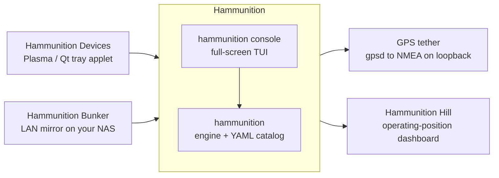

# 🐧 Renegade Penguin

**The expanded project home for work by [ChiefGyk3D](https://github.com/ChiefGyk3D)**

Cybersecurity · Linux · Amateur radio · Homelab · Automation · Hardware

**🔗 All my links:** [links.chiefgyk3d.com](https://links.chiefgyk3d.com)

---

## Why this exists

As my projects have grown in size, scope, and complexity, I needed to move beyond what made sense to keep entirely under a personal GitHub account. This organization gives larger projects, their related repositories, automation, documentation, and shared infrastructure a cleaner place to live: one project board across a family of repos, CI credentials scoped to an app instead of a person, and room for a second maintainer when one shows up.

That does **not** mean my personal GitHub is going away.

Work is actively shared between **<https://github.com/ChiefGyk3D>** and this organization. Depending on the project, you may find repositories here or under my personal account, and both are part of the same body of work, maintained by me. A project generally moves here when it outgrows a single repo or needs things a personal account cannot do well, and it keeps its history, issues, and links when it does. Renegade Penguin LLC is the entity behind the work; the code stays open source either way.

## What lives here

### 📡 The Hammunition suite

Hammunition turns a stock Debian-family install into an amateur radio and SDR workstation, then keeps it fed, controlled, and on time. One engine with its own console, and several small clients that only ever talk to it through its JSON interface.

| Project | What it does |
|---|---|
| **[Hammunition](https://github.com/ChiefGyk3D/Hammunition)** | Turns an existing Debian-family install into a full amateur radio, SDR, and RF experimentation workstation. A declarative YAML catalog of software and hardware kept strictly separate from the Python engine that installs it: idempotent, `--dry-run` accurate, with a transaction log and honest per-distro capability reporting. Targets Parrot OS, Debian, Ubuntu, Kali, and Raspberry Pi OS. Ships its own full-screen terminal front end, `hammunition console`. |
| **[Hammunition Hill](https://github.com/ChiefGyk3D/hammunition-hill)** | Hammunition builds the shack computer; Hill is what you put on the monitor above it. Six dashboards and twenty-eight panels that run on your own machine, on your own network, and talk to nobody you did not name. Propagation, space weather, alerts, satellites, and callsign lookup. |
| **[Hammunition Devices](https://github.com/ChiefGyk3D/hammunition-tray)** | Plasma 6 system-tray applet (with a Qt tray for Xfce, LXQt, LXDE, MATE, and Cinnamon) for parking and waking the radio devices Hammunition has catalogued, switching GPS services, the machine's radios, and GPS time mode. Never touches sysfs, never runs as root, one polkit prompt per action. |
| **[Hammunition Bunker](https://github.com/ChiefGyk3D/hammunition-bunker)** | Keeps a verified copy of Hammunition's offline data (map regions, elevation tiles, reference files) on a NAS and serves it on your LAN, so a field laptop installs from the next room instead of the internet, checking every byte exactly as it would from the publisher. Early: tested against a fake engine, not yet on a real NAS. |
| **[Hammunition GPS tether](https://github.com/ChiefGyk3D/hammunition-gps-tether)** | Serves your GPS receiver's position from gpsd as NMEA on loopback only, for programs that can't talk to gpsd themselves. Standard library only, runs as you, never as root. |

More moves in as it outgrows the personal account. The reusable CI these repos call, [git-your-ship-together](https://github.com/ChiefGyk3D/git-your-ship-together), stays under the personal account because every repo of mine uses it.

## What to expect

My projects generally live somewhere around the intersection of:

- Cybersecurity and defensive engineering
- Linux and open source
- Amateur radio and emergency communications
- Homelab and infrastructure engineering
- Automation and DevOps
- AI and local LLM experimentation
- Hardware hacking and embedded systems
- Tools built because I had a problem and decided to solve it myself

A lot of what you see here starts as something I personally wanted or needed, then grows into something other people might find useful too. And expect experimentation, active development, weird ideas, practical tooling, and plenty of projects that cross the usual lines between software, infrastructure, cybersecurity, radio, and hardware.

For additional projects, contributions, and ongoing development, also check out **<https://github.com/ChiefGyk3D>**.
